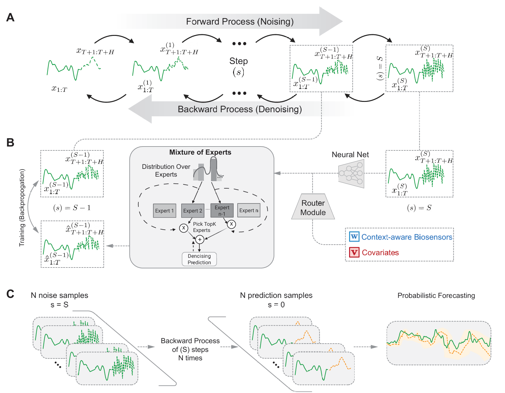

<div align="center">
  <!-- <h1><b> Time-LLM </b></h1> -->
  <!-- <h2><b> Time-LLM </b></h2> -->
  <h2><b> CAMEO (Context-Aware Mixture of Experts Flow) </b></h2>
  <h3><b> Probabilistic Time Series Forecasting via Context-Aware Flow Matching </b></h3>
</div>
<p align="center">

</p>


## Introduction

**CAMEO** (Context-Aware Mixture of Experts Flow) is a framework for probabilistic time series forecasting that leverages conditional diffusion models and flow matching techniques. The framework combines mixture of experts architectures with state-of-the-art generative modeling approaches to produce high-quality probabilistic forecasts with uncertainty quantification.


### Key Features

- **Flow Matching**: Alternative generative modeling approach using continuous normalizing flows
- **Mixture of Experts**: Leverages expert specialization for different time series patterns and domains
- **Uncertainty Quantification**: Provides probabilistic forecasts with confidence intervals
- **Multi-modal Conditioning**: Supports various types of covariates and auxiliary information


## Requirements

- accelerate==0.20.3
- einops==0.7.0
- matplotlib==3.7.0
- numpy==1.23.5
- pandas==1.5.3
- scikit_learn==1.2.2
- scipy==1.5.4
- torch==2.7.0
- tqdm==4.65.0
- peft==0.4.0
- transformers==4.31.0
- pytorch-frame==0.2.5
- lightning==2.5.1
- CRPS
- wandb
- pytorch-lightning
- timm
- torchdiffeq

To install all dependencies:
```bash
pip install -r requirements.txt
pip install deepspeed==0.13.0
pip install sentencepiece
```

## Datasets

The framework supports multiple time series datasets:

### Standard Benchmarks
- **ETT (Electricity Transforming Temperature)**: ETTh1, ETTh2, ETTm1, ETTm2
- **Weather**: Weather forecasting dataset
- **Electricity**: Electricity consuming load dataset
- **Traffic**: Road occupancy rates dataset
- **Exchange Rate**: Exchange rate dataset
- **Solar**: Solar power production dataset
- **PEMS**: Traffic flow dataset
- **M4**: M4 competition dataset
- **Illness**: Influenza-like illness dataset

### Medical/Health Data
- **Glucose**: Continuous glucose monitoring dataset for diabetes management

You can access the well pre-processed datasets from [[Google Drive]](https://drive.google.com/file/d/1NF7VEefXCmXuWNbnNe858WvQAkJ_7wuP/view?usp=sharing), then place the downloaded contents under `./dataset`

## Quick Start

### Training with Diffusion Models

1. **Glucose Dataset (Diffusion)**:
```bash
bash ./scripts/train_glucose_diffusion_slurm.sh
```

2. **Standard Datasets**:
```bash
# For other datasets, modify the scripts accordingly
bash ./scripts/glucose.sh
```

### Training with Flow Matching

The framework also supports flow matching as an alternative to diffusion:

```bash
python run_pl_diffusion.py --model_type flow_matching --dataset glucose --enable_covariates
```

## Model Architecture

### Diffusion Models
- **Time Series Diffusion Model**: Conditional diffusion process for time series generation
- **Noise Scheduling**: Advanced noise scheduling strategies
- **Conditional Sampling**: Guided sampling with historical context

### Flow Matching
- **Continuous Normalizing Flows**: Alternative to discrete diffusion steps
- **ODE-based Sampling**: Efficient sampling using ODE solvers
- **Flow Matching Loss**: Direct optimization of probability paths

### Mixture of Experts
- **Expert Specialization**: Different experts for different time series patterns
- **Covariate Conditioning**: Expert selection based on auxiliary information
- **Dynamic Routing**: Adaptive expert selection during inference

## Usage Examples

### Basic Training
```python
# Diffusion model training
python run_pl_diffusion.py \
    --model ns_Transformer \
    --data glucose \
    --enable_covariates \
    --pred_len 24 \
    --seq_len 96
```

### Flow Matching Training
```python
# Flow matching model training
python run_pl_diffusion.py \
    --model_type flow_matching \
    --model ns_Transformer \
    --data glucose \
    --enable_covariates \
    --pred_len 24 \
    --seq_len 96
```

### Evaluation
```python
# Model evaluation
python eval_pl.py \
    --checkpoint_path /path/to/checkpoint \
    --data glucose \
    --enable_covariates
```

## Configuration

Key hyperparameters can be configured:

- `--model`: Backbone model (ns_Transformer, ns_DLinear)
- `--model_type`: Generative model type (diffusion, flow_matching)
- `--enable_covariates`: Enable covariate conditioning
- `--pred_len`: Prediction horizon (number of future time steps to forecast)
- `--label_len`: Label length (number of time steps from the end of input sequence used as initial context for decoder)
- `--seq_len`: Input sequence length (historical time steps used as input)
- `--learning_rate`: Learning rate
- `--train_epochs`: Training epochs
- `--k_cond`: Conditioning loss weight
- `--k_z`: KL divergence weight

### Sequence Configuration Details

The framework uses a sliding window approach where:
- **Input Sequence (`seq_len`)**: Historical observations used for encoding context
- **Label Length (`label_len`)**: Overlap period between input and target sequences, providing initial context for the decoder
- **Prediction Length (`pred_len`)**: Future time steps to be forecasted

For example, with `seq_len=96`, `label_len=48`, and `pred_len=24`:
- Model observes 96 historical time steps
- Uses the last 48 time steps as decoder initialization context
- Forecasts the next 24 time steps into the future

## Acknowledgement

This implementation adapts and extends code from:
- [Time-LLM](https://github.com/KimMeen/Time-LLM): Reprogramming framework for time series
- [DiffusionMTS](https://github.com/diffusionMTS/diffusionMTS): Diffusion models for multivariate time series
- [Time-Series-Library](https://github.com/thuml/Time-Series-Library): Comprehensive time series analysis library

We thank the authors for sharing their implementations and related resources.

## Citation

If you use this code in your research, please cite:

```bibtex
@inproceedings{cdime2024,
  title={cDIME: Conditional Diffusion Mixture of Experts for Time Series Forecasting},
  author={[Authors]},
  booktitle={[Conference]},
  year={2024}
}
```

## License

This project is licensed under the MIT License - see the [LICENSE](LICENSE) file for details.

